# Plan_1

1. ### 安装TensorFlow

   ##### （应用于各类机器学习算法的编程实现），python3（主要编程语言）

   #####      jupyter notebook（一款开放源代码的 Web 应用程序，可让我们创建并共享代码和文档），anaconda（一个开源的Python发行版本

   [TensorFlow的安装](https://www.cnblogs.com/lvsling/p/8672404.html)

   (因为很早前已经安装了,所以这里你们自己想办法安装,安装cpu版本的先.)

2. ### 学习机器学习的一些基础知识

   ​            (可以跳过,直接看视频入手)

   > + ####  使用神经网络识别手写数字
   >
   >   1. **感知器**
   >
   > 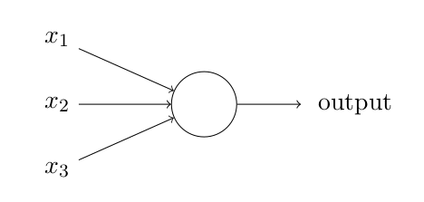
   >
   > 上面的这个东西就叫做感知器,
   >
   > x1,x2,x3,这些是二进制输入,他们都有属于他们的**权重** ,w1,w2,,,,,表示相应输入对于输出重要性的实数.
   >
   > output是神经元的输出,结果为0或1.由分配权重后的总和$$\sum{j}\omega_jx_j$$小于或者大于一些**阈值(threshold)** 决定
   >
   > 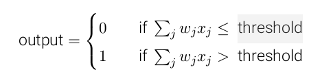
   >
   > 感知器网络:
   >
   > 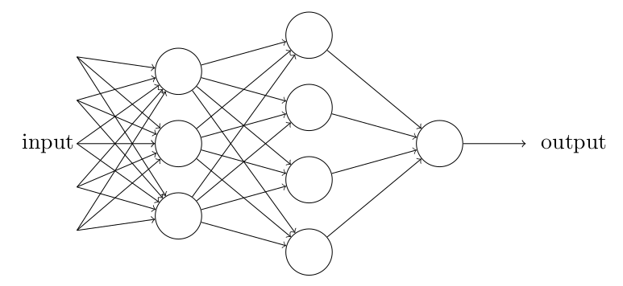
   >
   > 上面有三层感知器,下一层的感知器都在权衡上一层的决策结果并做出决定,所以下一层的感知器可以比上一层中的做出更复杂和抽象的决策.以这种方式,一个多层的感知器网络可以从事复杂巧妙的决策
   >
   > 这里做两个变动
   >
   > ​				1.	把 $$ \sum{j}\omega_jx_j $$ 改写成**点乘** , $$ \omega\cdot x \equiv  \sum{j}\omega_jx_j $$  
   >
   > ​				2.	**偏置 b**  $$b \equiv -threshold$$ 
   >
   > 则感知器的规则可以重写为:
   >
   > 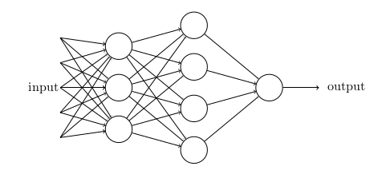
   >
   > (从此以后都不会出现阈值threshold这个东西了)
   >
   >   2. **S型神经元**
   >
   >   
   >
   >   正如一个感知器,S 型神经元有多个输入,x 1 , x 2 , . . .。但是这些输入可以取 0 和 1 中的任意
   >   值,而不仅仅是 0 或 1。例如,0.638 . . . 是一个 S 型神经元的有效输入。同样,S 型神经元对每个
   >   输入有权重,w 1 , w 2 , . . .,和一个总的偏置,b。但是输出不是 0 或 1。相反,它现在是 σ(w · x + b),
   >   这里 σ 被称为 S 型函数 1 ,定义为:
   >
   >   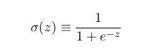
   >
   >   把它们放在一起来更清楚地说明,一个具有输入 x 1 , x 2 , . . .,权重 w 1 , w 2 , . . .,和偏置 b 的 S
   >   型神经元的输出是:
   >
   >   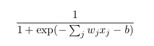
   >
   >   σ 的代数形式又是什么?我们怎样去理解它呢?实际上,σ 的精确形式不重要 —— 重要的是
   >   这个函数绘制的形状。是这样:
   >
   >   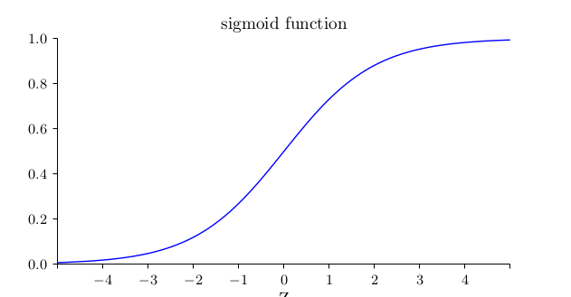
   >
   >   
   >
   >   这个形状是阶跃函数平滑后的版本:
   >
   >   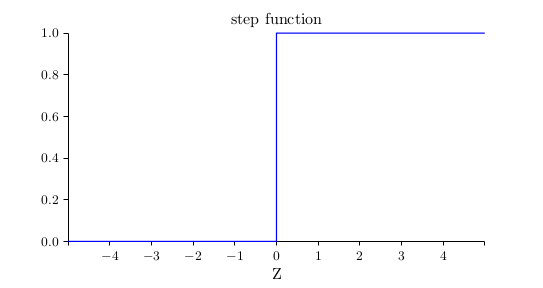
   >
   >   如果 σ 实际是个阶跃函数,既然输出会依赖于 w · x + b 是正数还是负数 2 ,那么 S 型神经元
   >   会成为一个感知器。利用实际的 σ 函数,我们得到一个,就像上面说明的,平滑的感知器。的
   >   确,σ 函数的平滑特性,正是关键因素,而不是其细部形式。σ 的平滑意味着权重和偏置的微小
   >   变化,即 ∆w j 和 ∆b,会从神经元产生一个微小的输出变化 ∆output。实际上,微积分告诉我们
   >   ∆output 可以很好地近似表示为:
   >
   >   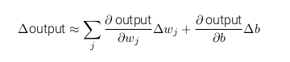
   >
   >   3. **神经网络的框架**
   >
   >   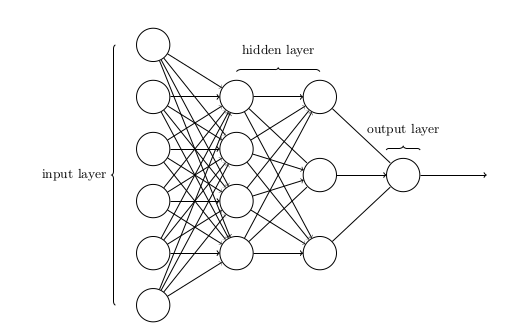
   >
   >   别名:多层感知器/MLP
   >
   >   4. **一个简单的分类手写数字的网络**
   >
   >   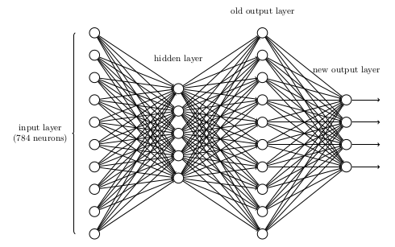
   >
   >   5. **使用梯度下降算法**
   >
   >   6. **实现我们的网络来分类数字**
   >
   >   [MNIST入门](https://github.com/blime4/GAN_AI/blob/master/Code/Plan_1_MNIST_91%25.py)
   >
   >   [MNIST改进](https://github.com/blime4/GAN_AI/blob/master/Code/Plan_1_MNIST_98%25.py)
   >
   >   7. **迈向深度学习**
   >
   > + #### 反向传播算法如何工作
   >
   >      计算代价函数的梯度的快速算法:	反向传播
   >
   >   (当成黑盒子,可以不看先)
   > 
   >+ #### 改进神经网络的学习方法
   > 
   >+ #### 神经网络可以计算任何函数的可视化证明
   > 
   >+ #### 深度神经网络为何很难训练
   > 
   >+ #### 深度学习
   
+ #### 相关连接:
  
  > [书籍:	神经网络与深度学习](https://github.com/blime4/Mybook/blob/master/tensorflow/%E7%A5%9E%E7%BB%8F%E7%BD%91%E7%BB%9C%E5%92%8C%E6%B7%B1%E5%BA%A6%E5%AD%A6%E4%B9%A0neural%20networks%20and%20deep-learning-%E4%B8%AD%E6%96%87_ALL.pdf)
     >
     > [视频:	bilibili莫烦教程](https://www.bilibili.com/video/av16001891?from=search&seid=5385868079792534716)
     >
     > [视频:	bilibili另一个教程](https://www.bilibili.com/video/av35974848?from=search&seid=10055890662041855685)
  
3. ### 通过学习卷积神经网络CNN来初步了解tensorflow

   + CNN结构演化图:

     

   + 初阶:	可以直接看视频;

     ​	[什么是卷积神经网络](https://www.bilibili.com/video/av16001891/?p=25)

     + 卷积层
     + 池化层
     + MNIST

   + 中阶:    了解并实现一些经典的卷积神经网络

     + LeNet-5 模型

   > 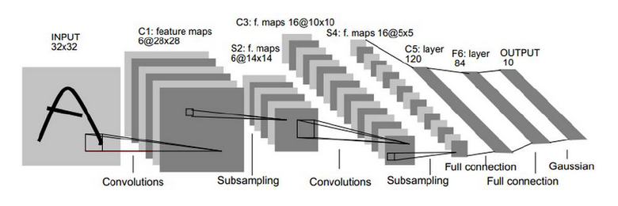
   >
   > INPUT(输入)---->C1(卷积)---->S2(池化)---->C3(卷积)---->S4(池化)---->C5(卷积)---->F6(全连接)---->OUTPUT(输出)
   >
   > + 这里有个地方要注意的是:S2层(6\*14\*14)怎么变成C3层(\*16\*10\*10)的?
   >
   >   解释:
   >
   >   C3层是一个卷积层，卷积和和C1相同，不同的是C3的每个节点与S2中的多个图相连。C3层有16个10x10的图，每个图与S2层的连接的方式如Table1 所示。C3与S2中前3个图相连的卷积结构见Figure 10.这种不对称的组合连接的方式有利于提取多种组合特征。改成有(5x5x3+1)x6 + (5x5x4 + 1) x 3 + (5x5x4 +1)x6 + (5x5x6+1)x1 = 1516个训练参数，共有1516x10x10=151600个连接。
   >
   >   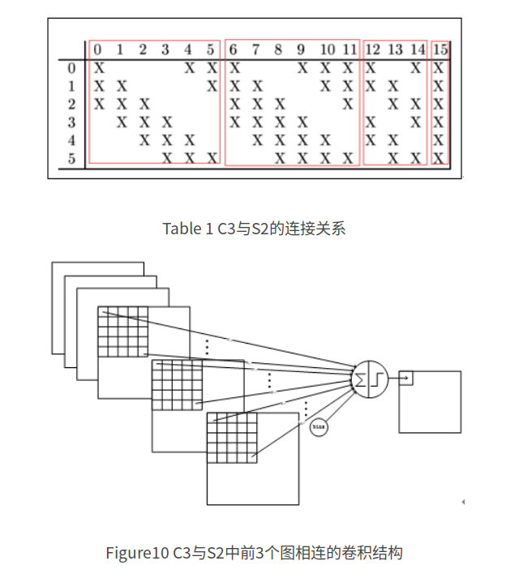
   >
   >   简单点说就是,把S2的多个输出放在一起凑,同时又因为这样凑的输出个数不同,就增加了更多奇奇怪怪的组合特征.

   + Inception-v3 模型

     >Inception结构是一种和LeNet-5结构完全不同的卷积神经网络结构
     >
     >**Inceptionv1:**
   >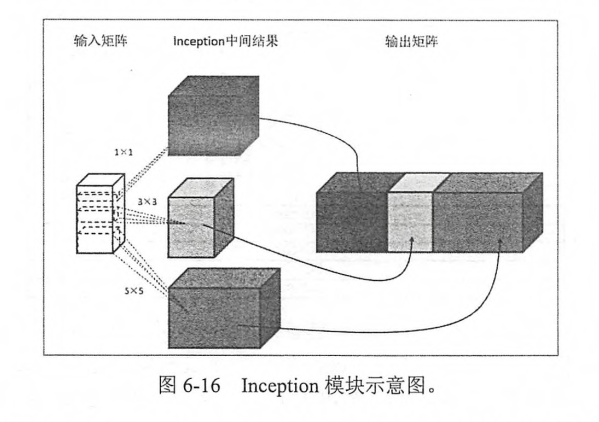
   >
   >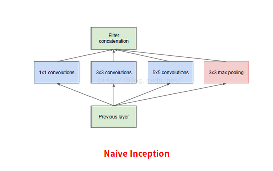
   >
   >解释:
   >
   >在原始的输入层,以不同的过滤器,卷积和池化得到一个Filter Concat(卷积连接层).**Inception module** 的提出主要考虑多个不同 size 的卷积核能够增强网络的适应力，Inception v1 中分别使用1\*1、3\*3、5\*5卷积核，同时加入3*3 max pooling。
   >
   >**每一层 Inception module 的 filters 参数量为所有分支上的总数和，多层 Inception 最终将导致 model 的参数数量庞大，对计算资源有更大的依赖。**
   >
   >Inception V1——构建了1x1、3x3、5x5的 conv 和3x3的 pooling 的分支网络，同时使用 MLPConv 和全局平均池化，扩宽卷积层网络宽度，增加了网络对尺度的适应性；
   >
   >> **Inception V2:**
   >
   >Inception V2 学习了 **VGG** 用两个3´3的卷积代替5´5的大卷积，在降低参数的同时建立了更多的非线性变换，使得 CNN 对特征的学习能力更强：
   >
   >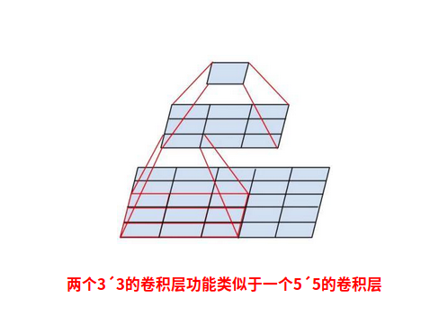
   >
   >(另外提出了著名的 **Batch Normalization**（以下简称BN）方法。BN 是一个非常有效的正则化方法，可以让大型卷积网络的训练速度加快很多倍，同时收敛后的分类准确率也可以得到大幅提高。)
   >
   >> **Inception V3:**
   >
   >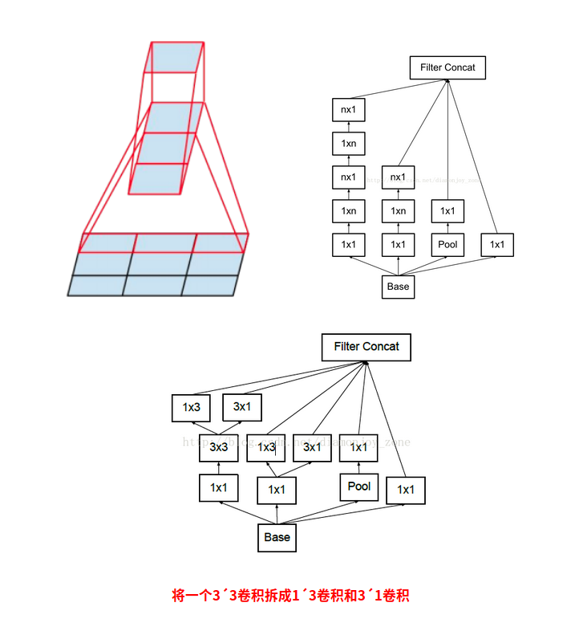
   >
   >引入了 Factorization into small convolutions 的思想，将一个较大的二维卷积拆成两个较小的一维卷积，比如将7´7卷积拆成1´7卷积和7´1卷积，或者将3´3卷积拆成1´3卷积和3´1卷积，如上图所示。一方面节约了大量参数，加速运算并减轻了过拟合（比将7´7卷积拆成1´7卷积和7´1卷积，比拆成3个3´3卷积更节约参数），同时增加了一层非线性扩展模型表达能力。 
   >
   >> **Inception v4:**

     代码:

     ​	[LeNet-5 模型]()

     ​	[Inception-v3 模型]()

     参考链接:

     ​	[Inceptionv1到 v4](https://blog.csdn.net/u014114990/article/details/52583912)

     	[Inception家族](https://www.chainnews.com/articles/727946354364.htm)

   ​	  [CNN卷积神经网络_ GoogLeNet 之 Inception(V1-V4)](https://blog.csdn.net/diamonjoy_zone/article/details/70576775)

   + 高阶:     

     + VGG
     
     + GoogLeNet
     
     + AlexNet
     
       [代码实现]()
     
     

4. ### 创建一个github项目共享我们的工作内容以及存放一些书籍文档

 

